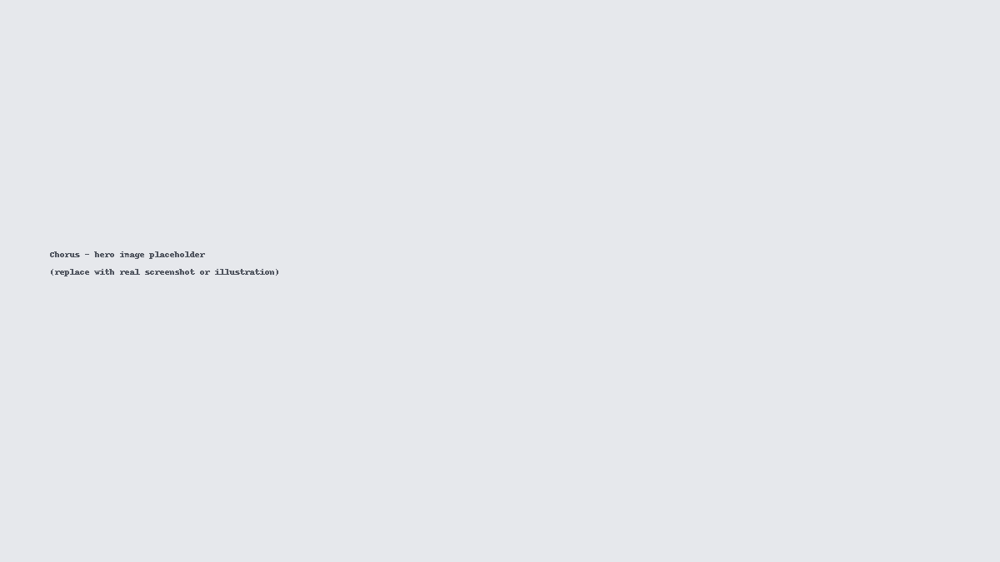
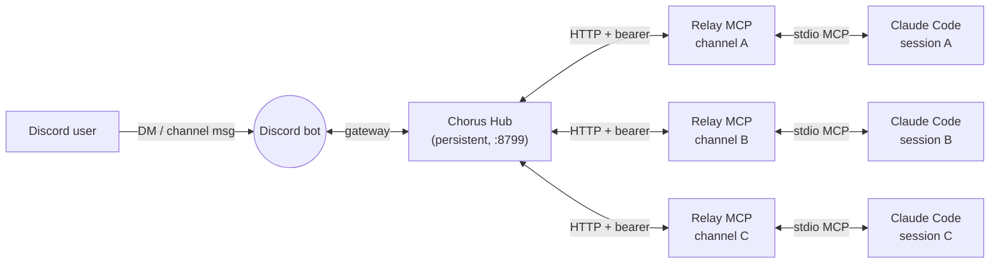
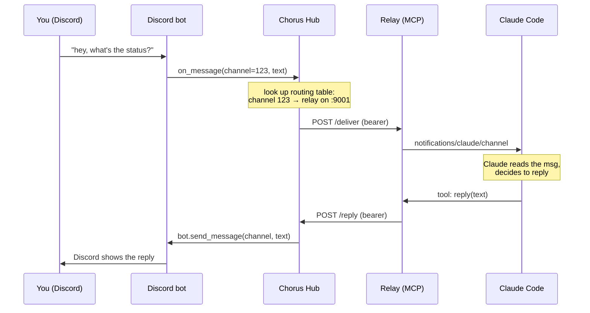

# Chorus

**Route a single Discord bot to multiple Claude Code sessions.** Like the [official Discord plugin](https://github.com/anthropics/claude-plugins-official/tree/main/external_plugins/discord), but multi-session — each Discord channel gets its own Claude Code session, all through one bot.



## What it does

- **One bot, many channels, many sessions.** Each Discord channel maps to a dedicated Claude Code session with its own working directory and context.
- **Full Claude Code capabilities per session** — tools, CLAUDE.md, hooks, skills, MCP servers, everything. The relay is a plain MCP plugin; nothing is stripped down.
- **Channel topic becomes the system prompt** — set a channel's Discord topic to "CCTrade options research, cwd: cctrade/" and that context loads automatically. Zero-config per-workspace routing.

## Quick start

```bash
pip install chorus-hub
claude plugin marketplace add zxiang77/chorus-marketplace
claude plugin install chorus-relay@chorus-marketplace

chorus configure <your-bot-token>      # save the Discord bot token
chorus allow    <your-user-id>         # allow yourself to reach the bot

chorus hub                              # terminal 1 — leave running
chorus connect <channel-id>             # terminal 2 — copy & run the printed command
```

Post a message in the Discord channel — Claude receives it, can reply, react, fetch history, and edit messages. Each channel gets its own Claude session; open another terminal and `chorus connect` a different channel ID to add one.

**Full walkthrough with expected-output checks at every step:** [docs/chorus/getting-started.md](docs/chorus/getting-started.md)

## How it works



**Hub** — one persistent Python process per machine. Holds the single Discord gateway connection, runs an aiohttp router on `localhost:8799`, owns the channel→relay routing table.

**Relay** — a short-lived TypeScript/Bun MCP server, one per Claude Code session. On startup it registers its channel and port with the Hub over HTTP; inbound Discord messages become `notifications/claude/channel` in the session's transcript.

The HTTP seam between Hub and Relay is the key design choice. Claude Code sessions come and go without re-authing the bot; one bot identity serves arbitrarily many sessions; the relay stays stateless (crash and the next session picks up). Hub and Relay authenticate with a shared bearer token in `~/.chorus/.secret`.

### What a message looks like end-to-end



Inbound is push (Discord gateway → Hub → relay notification). Outbound uses the `reply` tool exposed by the relay to Claude; the reply flows back through the Hub so there's only ever one Discord connection, regardless of how many sessions are active.

## Commands

| Command | Description |
|---------|-------------|
| `chorus hub` | Start the Hub (Discord bot + HTTP router) |
| `chorus status` | Show active channel-to-session mappings |
| `chorus connect <channel-id>` | Print the Claude Code launch command for a channel |
| `chorus allow <user-id>` | Add a Discord user to the sender allowlist |
| `chorus configure <token>` | Save the Discord bot token to `~/.chorus/.env` |
| `chorus configure` | Show token + hub status |
| `chorus configure clear` | Remove the saved token |

## Channel context

Set a Discord channel's **topic/description** in Discord's channel settings. The relay reads it on startup and injects it as system-prompt context automatically. Example topic: *"CCTrade options trading research. Working directory: cctrade/. Use `cctrade/CLAUDE.md` for conventions."*

## Troubleshooting

| Symptom | Fix |
|---------|-----|
| Hub won't start | Run `chorus configure <token>` (or export `DISCORD_BOT_TOKEN`); enable Message Content Intent in Discord Developer Portal |
| Messages not arriving | Run `chorus allow <user-id>`; verify `chorus status` shows the channel |
| Relay won't register | Start the Hub first (it creates `~/.chorus/.secret` on first run) |
| Reply doesn't appear in Discord | Check the bot has Send Messages permission in the channel |

## Roadmap

Architecture is channel-agnostic — Telegram and iMessage are the obvious next stops (Claude Code's channels API already supports them). Track progress or chime in on [issues](https://github.com/zxiang77/chorus/issues).

## Docs

- **[Getting started](docs/chorus/getting-started.md)** — end-to-end walkthrough with expected-output checks
- [Reference](docs/chorus/reference.md) — config schema, env vars, HTTP API, security model
- [E2E Testing](docs/chorus/e2e-testing.md) — contributor validation checklist

## Development

```bash
# Hub tests
python -m pytest hub/tests/ -v

# Relay tests
cd relay && bun test

# Lint
ruff check hub/
```

## License

MIT
